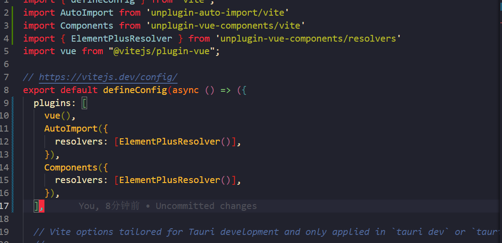

# Tauri + Vue 3 + Vite + Pinia + Vue Router
```bash
pnpm create tauri-app
pnpm install
pnpm install vue-router@4
pnpm install pinia
pnpm i -D @types/node
pnpm tauri dev
```

### 使用 element Plus UI
pnpm install element-plus
### 按需自动导入
pnpm install -D unplugin-vue-components unplugin-auto-import
  
### Windi CSS
pnpm i -D vite-plugin-windicss windicss


